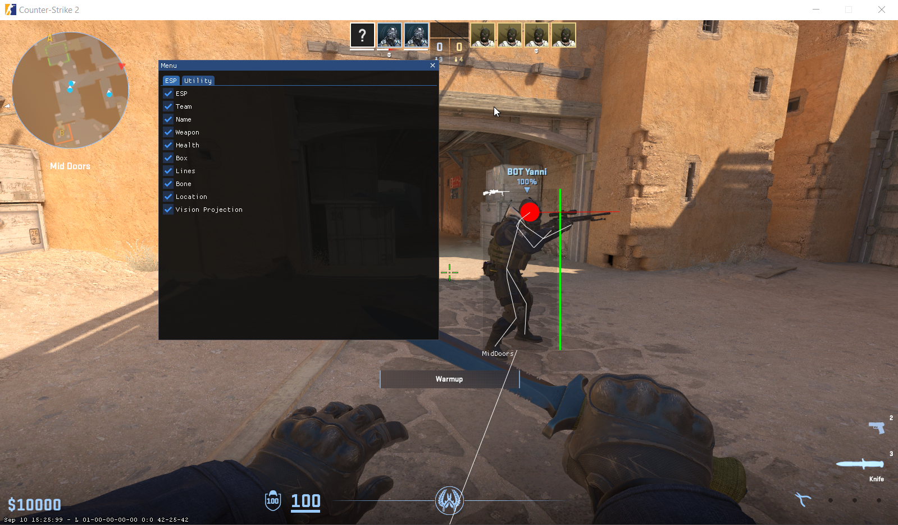

# CS2 External

> **Warning:**   
**DO NOT USE** This version is only for -insecure mode. 
If you wish to use in online competieve play, please refer to [main](https://github.com/LongpanZhou/CS2-External). 
---
### Introduction
This project is a proof of concept for using Discord overlay for rendering. The reason for this approach is that some anti-cheat systems detect suspicious window creation, which can trigger a flag or ban. By using whitelisted applications like Discord for rendering, we can avoid creating new windows or triggering suspicious activity, effectively bypassing detection.

### Issues
In some relution of the game will have screen teraing, not sure what the cause its therefore its not been fixed yet.

### Features:
#### ESP (Extrasensory Perception):
- Team
- Name (Not implemented in this version)
- Weapon
- Health
- Box
- Lines
- Bone
- Location
- Vision Projection

#### Utils:
- Bhop

---

