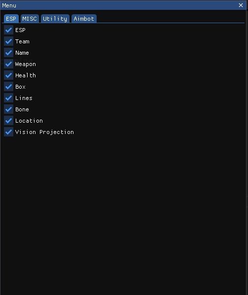

# CS2 External

**_This project is currently under development._**

If you like this project, or find this project helpful please give me a star. Thank you!

> [!IMPORTANT]
> If you only wish to use this cheat, please refer to [release](https://github.com/LongpanZhou/CS2-External/releases).

  

> [!WARNING]
> You need to run Vac Bypass with the exteranl cheat. You will get banned otherwise!
>  1. Run VacBypass Loader
>  2. Run Cheat
>  3. Enjoy

> [!NOTE]
> If you have any features/bugs you wish to report, please leave under [issues](https://github.com/LongpanZhou/CS2-External/issues) page, I will try my best to implement/fix them.  
> VAC bypass loader can be found on [github](https://github.com/danielkrupinski/VAC-Bypass-Loader) or [release](https://github.com/LongpanZhou/CS2-External/releases).

---

### Features:

#### ESP:

- ESP

- Team

- Weapon

- Health

- Lines

- Bone

- Location

- Vision Projection

### Misc

- All Entity

- Item

- Glow

- Bomb

### Utils:

- Bhop

- Radar

- NoFlash

- Third Person

### Aimbot

- Aimbot

- Change Aimbot Key

- Slient (R.I.P)

- Smooth

- Team

- Visibility Check

- Closest Angle Enemy

- CloSEST Distance Enemy

- Trigger

- FOV check

- Aim Position

---

### WorkList

(**Coming soon**)

- Embed Vac Bypass (Currently using VAC Bypass Loader)

  

### Progress History:

# Changelog

### V 1.0

- Implemented overlay using GLFW (OpenGL).

- Created a menu interface.

- Added features: Box ESP, Health ESP, Lines ESP, and Bhop.

- Initial commit.

  

### V 1.1

- Fixed calculations for ESP rectangles.

- Improved health bar display.

- Adjusted overlay size to prevent covering the game window.

- Introduced Bone ESP, utilizing `std::vector` for enhanced drawing performance.

  

### V 1.2

- Added Vision Projection.

- Implemented Location ESP.

- Included Weapon ESP.

- Added team checking functionality.

- Improved ESP visuals.

  

### V 1.3

- Updated weapon icons.

- Corrected entity list iteration (changed from 0x10 to 0x8).

  

### V 1.4

- This branch is now archived under [Discord](https://github.com/LongpanZhou/CS2-External/tree/Discord).

-  **Reason:** VAC Bypass does not function with Discord overlay, failing to detect the process window correctly.

  

### V 1.5

- Rescturctured code

- Reverted back to GLFW overlay.

- Updated to include library files.

- Enhanced entity list for multiplayer compatibility.

  

### V 2.0

- Fully operational in VAC-protected competitive gameplay.

- Initial release.

  

### V 2.1

- Resolved ESP box color bug.

- Fixed Bhop functionality.

- Updated Glow feature.

- Enhanced Bomb ESP.

- Corrected weapon icons.

- Fixed readme.md (Still ugly)

  

### V 2.2

- Updated Aimbot Features

- Slient AimBot

  

### V 2.3

- AutoDrag Drop load offsets

- fixed find neareast angle enemy

- Smooth aimbot

- Better trigger bot - force attack, attack delay, between attack delay.

- Updated Third Person

- R.I.P slient Aim (Patched)

###  V 2.4
- Fixed Item ESP

- Added all entity ESP

- Modified weapon.hpp icons

- Custom offsets broken (game update)  will fix in signature scanning.

### V 2.5

- Auto update signature scanning

- Updated offsets for forcejump and forceattack

- Fixed trigger bot

- Added Recoil Control System (Aimbot as well)

### Current Progress

  

### R.I.P silent aim (lived one patch)

